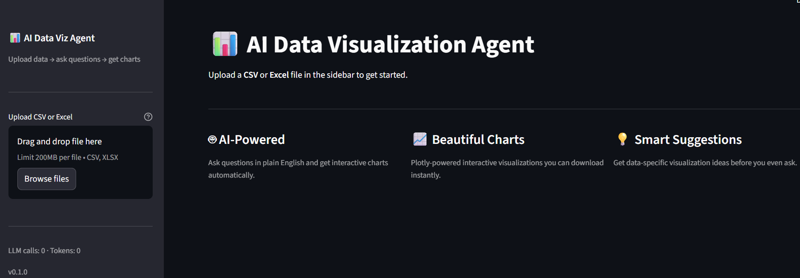
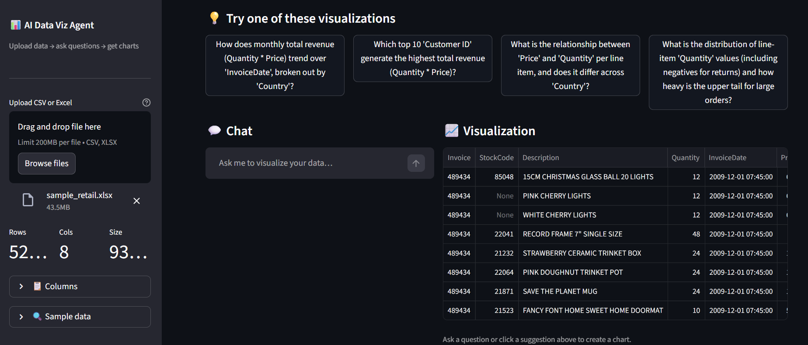
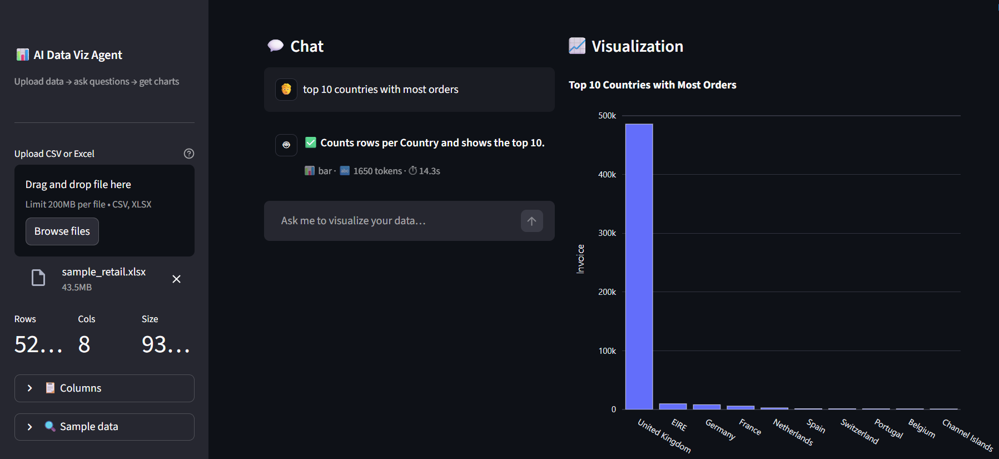

# AI Data Visualization Agent

**An AI-powered data visualization platform built with Streamlit, OpenAI, and Python tooling.**

[](https://github.com/yourorg/ai-data-viz-agent/actions/workflows/ci.yml)
[](https://www.python.org/downloads/)
[](https://opensource.org/licenses/MIT)

---

## 🎯 What I Built

I created an intelligent data visualization agent that transforms natural language questions into interactive charts. Upload your CSV or XLSX files, ask questions in plain English, and watch as the AI generates beautiful, interactive visualizations powered by Plotly.


*Main interface with file upload, smart suggestions, and interactive chat*

### ✨ Key Features

- **🤖 Natural Language Interface**: I designed a chat-based UI where you can ask questions like "Show me monthly revenue by region" and get instant visualizations
- **📊 Multiple Chart Types**: I support line, bar, scatter, histogram, box, heatmap, pie, and area charts
- **🧠 Context-Aware Memory**: I implemented persistent chat history with SQLite and optional vector search for semantic context retrieval
- **🔒 Security First**: I never execute arbitrary code - all LLM outputs are validated JSON specifications mapped to safe Pandas operations
- **⚡ Production-Ready**: I included Docker support, CI/CD pipelines, comprehensive tests, structured logging, and error handling
- **🎨 Interactive & Exportable**: I built charts with Plotly for interactivity, with Seaborn fallback, and export to HTML/PNG

---

## 🚀 Quick Start

### Prerequisites

I designed this project to work with Python 3.12 and use `uv` for dependency management. Here's what you need:

- Python 3.12 (I recommend using `uv` to manage Python versions)
- [uv](https://astral.sh/uv/) package manager
- OpenAI API key

### Installation

```bash
# Clone the repository
git clone https://github.com/yourorg/ai-data-viz-agent.git
cd ai-data-viz-agent

# Install uv if you don't have it
curl -LsSf https://astral.sh/uv/install.sh | sh

# Create and activate virtual environment with Python 3.12
uv venv --python 3.12
source .venv/bin/activate  # On Windows: .venv\Scripts\activate

# Install dependencies
uv pip install -e .

# Copy environment template and add your API key
cp .env.example .env
# Edit .env and add your OPENAI_API_KEY
```

### Running the Application

```bash
# Start the Streamlit app
uv run streamlit run streamlit_frontend/app.py

# Or with the activated virtual environment
streamlit run streamlit_frontend/app.py
```

The application will open in your browser at `http://localhost:8501`.


*Live Streamlit application with data profiling and visualization controls*

---

## 📖 Usage

### Basic Workflow

1. **Upload Data**: I provide a file uploader in the sidebar - drop your CSV or XLSX file there
2. **Explore**: I automatically profile your dataset and suggest visualizations
3. **Ask Questions**: I've built a chat interface where you can ask natural language questions like:
   - "Show me the distribution of sales"
   - "Compare revenue by region over time"
   - "Create a scatter plot of price vs quantity"
4. **Refine**: I allow you to modify visualizations through manual controls or follow-up questions
5. **Export**: I provide options to download charts as HTML (interactive) or PNG (static)

### Example Queries

```
"Show monthly revenue as a line chart"
"Compare average sales by product category using a bar chart"
"Create a scatter plot of price vs units sold, colored by region"
"Show the distribution of customer ages"
"Display revenue by region as a pie chart"
```


*AI-generated interactive charts with download options and explanations*

---

## 🏗️ Architecture

I've organized the project into clear modules:

```
ai-data-viz-agent/
├── core/                   # Configuration, logging, exceptions
├── services/
│   ├── ingest/            # CSV/XLSX parsing with validation
│   ├── profile/           # Data profiling and statistics
│   ├── llm/               # OpenAI API client with retry logic
│   ├── planner/           # Spec generation (no code execution!)
│   ├── renderer/          # Plotly and Seaborn renderers
│   └── memory/            # SQLite and vector memory backends
├── streamlit_frontend/     # Streamlit UI components
│   ├── app.py             # Main application
│   └── components/        # Reusable UI components
├── tests/                 # Comprehensive test suite
├── .github/workflows/     # CI/CD pipelines
└── docs/                  # Additional documentation
```

For detailed architecture documentation, see [ARCHITECTURE.md](ARCHITECTURE.md).

---

## 🔒 Security

I take security seriously. Here's what I've implemented:

- ✅ **No Arbitrary Code Execution**: I never run LLM-generated Python code. All outputs are JSON specifications validated with Pydantic.
- ✅ **File Validation**: I sanitize filenames, limit upload sizes (50MB default), and validate file types.
- ✅ **Input Sanitization**: I strip dangerous characters from column names and filter operations.
- ✅ **API Key Protection**: I never log or expose API keys. They're loaded from environment variables only.
- ✅ **Safe Operations**: I use only controlled Pandas methods (no `eval`, `exec`, or `__import__`).

For reporting vulnerabilities, see [SECURITY.md](SECURITY.md).

---

## 🧪 Development

### Running Tests

```bash
# Run all tests with coverage
uv run pytest -v --cov

# Run specific test file
uv run pytest tests/test_ingest.py

# Run with output
uv run pytest -v -s
```

### Linting and Formatting

```bash
# Check code style
uv run ruff check .

# Format code
uv run black .

# Type checking
uv run mypy .
```

### Docker Development

```bash
# Build and run with Docker Compose
docker-compose up --build

# Build Docker image manually
docker build -t ai-viz-agent:latest .

# Run container
docker run -p 8501:8501 --env-file .env ai-viz-agent:latest
```

---

## 📊 Project Status

I've implemented all core features for v0.1.0:

- ✅ CSV/XLSX parsing with validation
- ✅ Data profiling and auto-recommendations
- ✅ OpenAI LLM integration with retry logic
- ✅ JSON spec-based visualization generation
- ✅ Plotly renderer with safe operations
- ✅ Seaborn fallback renderer
- ✅ SQLite memory backend
- ✅ Vector memory adapter (ChromaDB)
- ✅ Streamlit chat UI
- ✅ Manual plot controls
- ✅ Export functionality
- ✅ Comprehensive tests
- ✅ Docker support
- ✅ CI/CD pipeline

### Roadmap

I'm planning these features for future releases:

- [ ] Helm chart for Kubernetes deployment
- [ ] Prometheus metrics endpoint
- [ ] Sentry integration for error tracking
- [ ] Additional chart types (3D, maps, network graphs)
- [ ] Data transformation UI
- [ ] Multi-file dataset support
- [ ] Collaboration features

---

## 🤝 Contributing

I welcome contributions! Please see [CONTRIBUTING.md](CONTRIBUTING.md) for guidelines.

Quick summary:
1. Fork the repository
2. Create a feature branch (`git checkout -b feature/amazing-feature`)
3. Make your changes and add tests
4. Run the linter and tests
5. Commit with a descriptive message
6. Push and open a pull request

---

## 📄 License

I've released this project under the MIT License. See [LICENSE](LICENSE) for details.

---

## 🙏 Acknowledgments

I built this project using these excellent tools and libraries:

- [Streamlit](https://streamlit.io/) - For the reactive web framework
- [Plotly](https://plotly.com/) - For interactive visualizations
- [OpenAI](https://openai.com/) - For natural language understanding
- [uv](https://astral.sh/uv/) - For fast Python package management
- [Pydantic](https://pydantic.dev/) - For data validation
- [SQLAlchemy](https://www.sqlalchemy.org/) - For database ORM

---

## 📬 Contact

- **Issues**: [GitHub Issues](https://github.com/yourorg/ai-data-viz-agent/issues)
- **Discussions**: [GitHub Discussions](https://github.com/yourorg/ai-data-viz-agent/discussions)

---

## ⭐ Support

If you find this project useful, please consider giving it a star on GitHub!

---

**Built with ❤️ using Python, Streamlit, and OpenAI**
